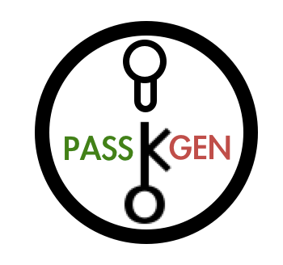

##about

PassGen is a basic secure password generation package and associated cmdline tool. Generated passwords can be of arbitrary length, and conform to the following **basic policies**:

* **Alpha** - mixed cased roman alphabet passwords

     ex: fdUhcJupKPzOIKBaLfqe

* **Numeric** - numeric digits in range 0-9

     ex: 92167663796913288031

* **AlphaNumeric** - combined Alpha and Numeric policies

     ex: Wll77E6bm6TA25agYu60

* **Printable** - ascii characters in range 33-126 inclusive

     ex: AZn#))q<(m*f42F"+&9-

* **Special Characters** - any of the basic policies, minus the all inclusive **Printable** policy -- can be augmented with specifying a string consisting of candidate "special characters". (*Note that per your command line shell, you may need to suitably escape the special character string.*)

      ex: ]06.8!2[699/][6[61\0 -- given Numeric policy with ".[]!\/" special characters spec.

##usage

Refer to the provided example cmdline tool.

## License 

    Copyright 2016 Joubin Houshyar. All rights reserved.

    Redistribution and use in source and binary forms, with or without-
    modification, are permitted provided that the following conditions are
    met:

       * Redistributions of source code must retain the above copyright
    notice, this list of conditions and the following disclaimer.
    
       * Redistributions in binary form must reproduce the above
    copyright notice, this list of conditions and the following disclaimer
    in the documentation and/or other materials provided with the
    distribution.
    
       * Neither the name of Google Inc. nor the names of its
    contributors may be used to endorse or promote products derived from
    this software without specific prior written permission.

    THIS SOFTWARE IS PROVIDED BY THE COPYRIGHT HOLDERS AND CONTRIBUTORS
    "AS IS" AND ANY EXPRESS OR IMPLIED WARRANTIES, INCLUDING, BUT NOT
    LIMITED TO, THE IMPLIED WARRANTIES OF MERCHANTABILITY AND FITNESS FOR
    A PARTICULAR PURPOSE ARE DISCLAIMED. IN NO EVENT SHALL THE COPYRIGHT
    OWNER OR CONTRIBUTORS BE LIABLE FOR ANY DIRECT, INDIRECT, INCIDENTAL,
    SPECIAL, EXEMPLARY, OR CONSEQUENTIAL DAMAGES (INCLUDING, BUT NOT
    LIMITED TO, PROCUREMENT OF SUBSTITUTE GOODS OR SERVICES; LOSS OF USE,
    DATA, OR PROFITS; OR BUSINESS INTERRUPTION) HOWEVER CAUSED AND ON ANY
    THEORY OF LIABILITY, WHETHER IN CONTRACT, STRICT LIABILITY, OR TORT
    (INCLUDING NEGLIGENCE OR OTHERWISE) ARISING IN ANY WAY OUT OF THE USE
    OF THIS SOFTWARE, EVEN IF ADVISED OF THE POSSIBILITY OF SUCH DAMAGE.